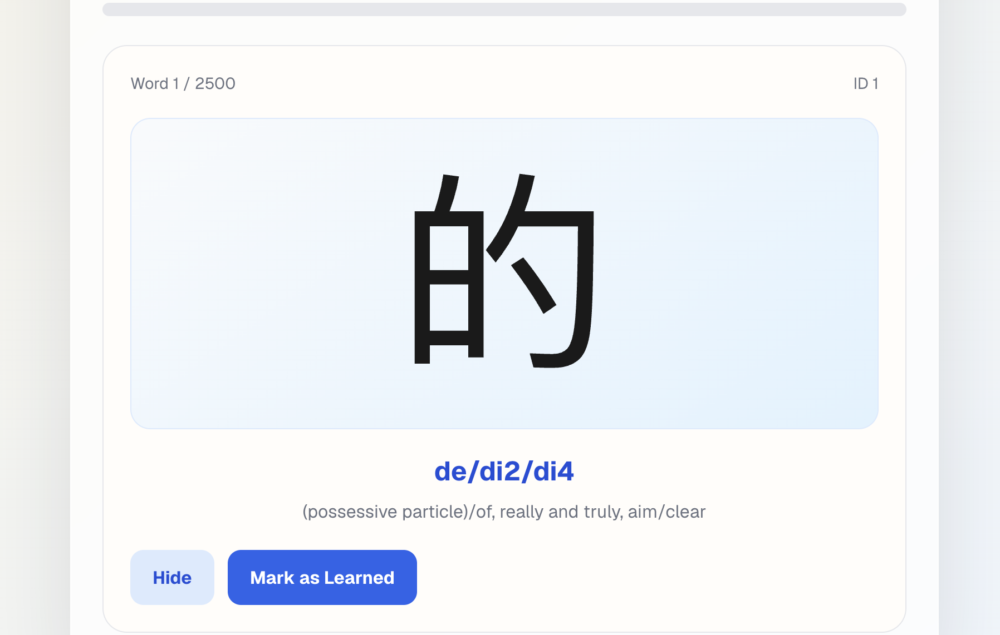

Notes from Meichen

We should give information to the user that the frist pronuanciation and first meanings are the most common for the word then whatever comes afterwards becomes less and less common (more like the those after meanings will be used depending on context but the first prononciation and meaning are for more likely for the word itself seperately), and that learning first or two meainings and prononciation will be enough 

We need to have words right prononciation for the users maybe audio button on the right side of the card

We need pronunciation check for the users to check their pronunciations , mic icon on the left side of the card

User needs to have a button so he/she can go back to previous words

User needs to have a Word Practice section for the words that been already learned

User needs to have a practice algorithm (Feynman method) like the anki app has (my note)

User needs to have easyness or hardness level of how hard was remembering the word so it could be used in algorithm that we will have (my note)

We need to add AI to generate the sentences from the known words (my note)

Maybe it will be nice to encrouge the users not to get down when they practice words. (for example, from what Meichen told me, user might get down, or depressed when they see that if they haven't yet memorized the word, and that they still need to practice it, we somehow should b eable to manage that also)

Note to myself. I need to remember that this app is being created firstly for myself.